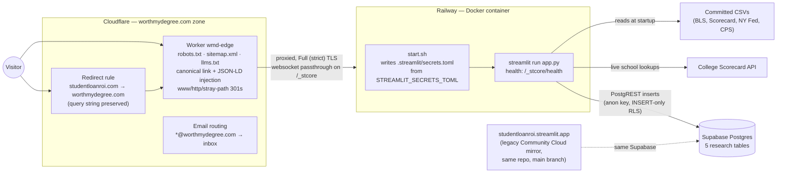
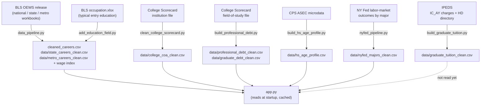
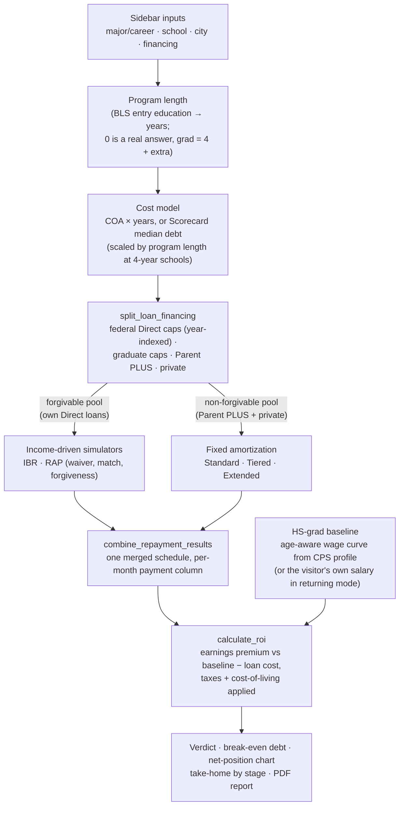

# Architecture

What runs where, how the pieces talk to each other, and where each number
on screen comes from. This is the **map**. Code comments throughout the
repo also cite `CLAUDE.md`, an internal **field guide** of accumulated
lessons — why the code is shaped the way it is and what breaks when you
touch it carelessly — which is deliberately not included in this
repository.

## The one-paragraph version

A single-file Streamlit app (`app.py`, ~16,000 lines) models the real
financial outcome of a major/school/loan choice — 10-year ROI against a
debt-free high-school graduate, every current federal repayment plan
(2026 rules: RAP, Tiered Standard, IBR), real federal/state taxes, and
cost of living by metro. It reads pre-cleaned government datasets
committed to the repo, logs anonymous usage to Supabase for a companion
behavioral-economics research paper, and is served from a Docker
container on Railway behind a Cloudflare Worker that supplies everything
a Streamlit app cannot (canonical URLs, robots.txt, structured data).

## System topology



Load-bearing details:

- **The Worker never rewrites request URLs or bodies** — only response
  heads. `?src=` attribution, share links, and `?test=1` reach Streamlit
  exactly as typed. `/_stcore` passes through untouched: it carries the
  websocket, which *is* the app's runtime, plus Railway's health check.
  Source of truth: `infra/worker.js`; runbook: `infra/SEO_DEPLOY.md`.
- **The image contains no secrets.** `st.secrets` only reads
  `.streamlit/secrets.toml`, so the deploy platform stores that file's
  contents in one env var (`STREAMLIT_SECRETS_TOML`) and `start.sh`
  materializes it at boot. Rotating a secret = edit one variable,
  redeploy.
- **Every dependency is pinned exactly** (`requirements.txt`,
  `runtime.txt` → Python 3.13, `Dockerfile` → `python:3.13-slim`). An
  unpinned deploy once drifted onto brand-new pandas/pyarrow/Streamlit
  on Python 3.14 and segfaulted on every page load.
- The legacy Community Cloud host still builds from `requirements.txt` +
  `runtime.txt` (it ignores the Dockerfile) and writes to the **same**
  production Supabase.

## One URL, several pages

The app has exactly one route; query params select the page:

| URL | Page |
|---|---|
| `/` | The calculator (sidebar + results) |
| `/?tool=repayment` | Repayment-plan comparison, standalone (`STANDALONE_TOOLS`) |
| `/?tool=schools` | Budget school search, standalone (`STANDALONE_TOOLS`) |
| `/?admin=<admin_key>` | Admin analytics dashboard, its own page — key lives in secrets.toml, fails closed, session logs nothing. Deliberately **not** in `STANDALONE_TOOLS` (that registry feeds pageview actions, traffic splits, and cross-links) |
| `/?test=1` | Any page, with all Supabase writers disabled (developer/test sessions) |

Standalone pages hide the sidebar with CSS (it still executes — it
defines names later code reads), render their module with
`always_open=True`, and `st.stop()`. Share links serialize the entire
sidebar into query params and reconstruct it on load
(`build_share_params` → `get_shared_*` → `st.session_state.setdefault`);
`check_share_coverage.py` proves every input is either wired through
that pipeline or deliberately exempted.

## `app.py`: five sections, and a contract about the first two

```text
1. CONFIGURATION & CONSTANTS   curated data, RAP/tax/COL constants, mode flags
2. HELPER FUNCTIONS            all non-UI logic:
   2a formatting/vocab  2b Supabase logging  2c school data/Scorecard
   2d/2e loan + IDR/RAP simulators  2f ROI math  2h taxes  2i cost-of-living
   2j Plotly charts  2k PDF (reportlab + matplotlib)  2m repayment-tool logic
3. PAGE CONFIG & SESSION STATE latches: test_mode, admin_revealed, active_tool
4. SIDEBAR                     scenario A/B inputs, before-the-widget reads
5. MAIN PAGE                   5a admin page  5b school lookup  5c results
                               5d take-home  5e survey  5f methodology
```

**The section banners are load-bearing.** `analyze_model.py` and the seven
guard scripts that test the MODEL `exec` everything above the section-3
banner to get the constants and math without the UI. (`check_graduate_tuition.py`
is the exception: it checks a committed dataset, not the app, so it never
loads `app.py`.) That contract — sections 1–2 contain
no module-level Streamlit *calls* — is why the research paper's numbers
and the app's numbers cannot drift apart: they run the same code, not a
reimplementation. (One wart: the "2m" repayment-comparison functions
physically sit inside section 4, so each guard carries an extra AST pass
to pull them in.)

## Data pipelines: raw releases → committed CSVs

`app.py` never fetches or cleans raw government data. Standalone scripts
regenerate the committed CSVs from fresh releases; the app just reads
them at startup.



`data/graduate_tuition_clean.csv` is the one committed dataset `app.py` does
not read. It is the prerequisite for a graduate school selector — Scorecard
publishes no graduate cost of any kind, so the search has never been able to
offer a graduate level — and it ships ahead of that UI so its coverage can be
judged before anything is built on it. IPEDS is the only federal source, and
it publishes **tuition and fees only**: there are no graduate living costs
anywhere in it, which is why nothing here is called a cost of attendance.

Two rules that keep the CSVs honest:

- **Career wages layer national → state → metro, in that order.** The
  national file's 825 occupations are the spine; the selected city's
  state overlays it, then its metro. Coarser must never overwrite finer,
  and every row is stamped with the geography it came from.
- **All OEWS-derived files must come from the same release year.** The
  app shows metro and national wages side by side; a one-year vintage
  mismatch reads as a pay cut, not as staleness. The vintage lives only
  in the source filename, so regenerate all three in one pass.

Local-only research tools (never imported by the app): `analyze_model.py`
(break-even simulation study), `analyze_survey.py`, `analyze_traffic.py`
(+ `daily_digest.sh` on a launchd schedule).

## The financial model, end to end



Three invariants the guards enforce (see the table below):

- **Only federal Direct loans may be forgiven.** Income-driven plans run
  on the forgivable pool only; blending once "forgave" $464k of private
  money on a $193k loan.
- **One income-driven payment covers ALL federal loans.** New borrowing
  and an existing balance pool into one payment; simulating them
  separately doubled the bill.
- **Money balances:** `payments + forgiven + government match ==
  principal + interest` across every simulator.

Everything user-visible is built twice on purpose: every on-screen chart
is Plotly (2j) and its PDF counterpart is matplotlib (2k), because the
Plotly→PNG exporter needs a headless Chromium that segfaulted the
server. The two implementations share *data* (and, for the wage
ridgeline, geometry) but not drawing code — changing one means changing
its twin.

## Research telemetry

Five Supabase tables, all inserts through `json_safe_row` (NaN and numpy
scalars reject whole rows otherwise), all carrying `session_id` (random
UUID per browser session) and a visitor-local timestamp:

| Table | Written when |
|---|---|
| `usage_logs` | one `pageview` per session, `nav:` cross-page events, free-text actions (school searches, repayment-tool PDF/share) |
| `scenario_events` | each distinct major/school/city a session lands on, ordered by `event_seq` — the exploration path itself |
| `survey_responses` | the anonymous impact survey (5e) |
| `pdf_downloads` | PDF report generation |
| `scenario_shares` | Share Scenario clicks |

The instrument around them: `?src=` tags recruitment channels (latched;
survives shares for the sharer, deliberately not inherited by
recipients), `get_experiment_arm()` randomizes visitors into
single-scenario vs Compare Mode framing (the paper's H2 — which is why
both result branches must render the same blocks), and `?test=1` or the
admin page turn every writer off. The anon key can INSERT but not
DELETE; schema changes are manual SQL recorded in `migrations.sql`, and
a column missing from Supabase silently drops the *entire* row — the
single most expensive failure mode this codebase has shipped.

## The guards

No test suite; instead, six fast scripts that exec the section 1–2
prefix and assert on the model. Each exists because a specific bug
shipped; each has a negative control (break the code, watch it fail).

| Guard | Proves |
|---|---|
| `check_share_coverage.py` | every sidebar input round-trips a share link or is exempt with a reason |
| `check_repayment_invariants.py` | simulators balance their books (payments + forgiven + match = principal + interest) |
| `check_rap_payment_table.py` | RAP payments match studentaid.gov's published chart, every row, both edges |
| `check_plan_switching.py` | prior IDR payments credit into RAP; RAP months (almost) never credit back |
| `check_internal_links.py` | cross-page links carry `test`/`src`, never `admin`; `nav:` events can't collide with pageview actions |
| `check_combined_repayment.py` | one income-driven payment covers all federal loans; merged schedules step down |

Run the relevant ones before every commit. A wrong-but-consistent number
passes the invariant check and fails the table check — they are not
interchangeable.

## Repo layout

```text
app.py                     the entire application
requirements.txt           exact pins (see comment at top before bumping)
runtime.txt                Python 3.13 for the legacy Community Cloud host
Dockerfile / start.sh /    Railway deployment (secrets from env at boot)
  railway.json
data/*.csv, cleaned_*.csv  committed pipeline outputs the app reads
*_pipeline.py, build_*.py, dataset regeneration from raw releases
  clean_*.py, add_*.py
check_*.py                 the six guards
analyze_*.py               local research tools (need local secrets)
infra/                     Cloudflare Worker + robots/sitemap/llms.txt + runbook
migrations.sql             every manual Supabase schema/data change
CLAUDE.md                  internal field guide (local only, not in the repo)
```
